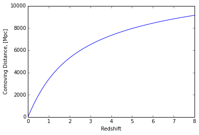
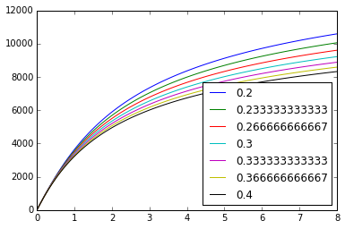

Dealing with Cosmological Models
================================

``hmf`` uses the robust ``astropy`` cosmology framework to deal with
cosmological models. This provides a range of cosmographic functionality
for free.

Cosmological models are the most basic ``Framework`` within ``hmf``.
Every other ``Framework`` depends on it. So knowing how to specify the
models is important (but very simple!).

.. code:: ipython2

    from hmf import cosmo
    %matplotlib inline
    import matplotlib.pyplot as plt
    import numpy as np

Default Settings
----------------

Like everything in ``hmf``, the ``Cosmology`` framework has all
parameters specified with defaults. In this case, there are only two
parameters -- a base cosmological model, and a dictionary of
cosmological parameters with which to alter it. By default, the
cosmological model is a Flat LambdaCDM model infused with the Planck15
parameters. The dictionary is empty, so we don't modify anything:

.. code:: ipython2

    my_cosmo = cosmo.Cosmology()

The intrinsic ``astropy`` object is found as the ``cosmo`` attribute of
the class we just created. Beware, there is also a ``cosmo_model``
attribute, which should only be treated as a parameter, never used in
calculations. It has not been supplemented with any custom parameters.
We can check out the parameters defined within the model:

.. code:: ipython2

    print "Matter density: ", my_cosmo.cosmo.Om0
    print "Hubble constant: ", my_cosmo.cosmo.H0
    print "Dark Energy density: ", my_cosmo.cosmo.Ode0
    print "Baryon density: ",  my_cosmo.cosmo.Ob0
    print "Curvature density: ", my_cosmo.cosmo.Ok0

.. parsed-literal::

    Matter density:  0.3075
    Hubble constant:  67.74 km / (Mpc s)
    Dark Energy density:  0.691009934459
    Baryon density:  0.0486
    Curvature density:  0.0

Or we can check out some cosmographic quantities, like the comoving
distance as a function of redshift:

.. code:: ipython2

    z = np.linspace(0,8,100)
    plt.plot(z,my_cosmo.cosmo.comoving_distance(z))
    plt.ylabel("Comoving Distance, [Mpc]")
    plt.xlabel("Redshift")

.. parsed-literal::

    <matplotlib.text.Text at 0x7fa3b8b94a10>

Passing a cosmological model
----------------------------

The ``cosmo`` module contains several pre-made instances of cosmologies
which might be useful, which we can input as our default model:

.. code:: ipython2

    my_cosmo = cosmo.Cosmology(cosmo_model=cosmo.WMAP5)

    print "WMAP5 baryon density: ", my_cosmo.cosmo.Ob0

.. parsed-literal::

    WMAP5 baryon density:  0.0459

Alternatively, we can create our own. The ``astropy`` package contains
the basic tools to do this. To create a standard Flat LambdaCDM
cosmology:

.. code:: ipython2

    from astropy.cosmology import FlatLambdaCDM
    new_model = FlatLambdaCDM(H0 = 75.0, Om0=0.4, Tcmb0 = 5.0, Ob0 = 0.3)

This new model can be used as input to the ``Cosmology`` class:

.. code:: ipython2

    my_cosmo = cosmo.Cosmology(cosmo_model = new_model)
    print "Crazy cosmology baryon density: ", my_cosmo.cosmo.Ob0

.. parsed-literal::

    Crazy cosmology baryon density:  0.3

The ``cosmo_model`` needn't be a Flat LambdaCDM. It can be any subclass
of FLRW. Thus we could use a non-flat model:

.. code:: ipython2

    from astropy.cosmology import LambdaCDM
    new_model = LambdaCDM(H0 = 75.0, Om0=0.4, Tcmb0 = 0.0, Ob0 = 0.3, Ode0=0.4)

    my_cosmo = cosmo.Cosmology(cosmo_model = new_model)
    print "Crazy cosmology curvature density: ", my_cosmo.cosmo.Ok0

.. parsed-literal::

    Crazy cosmology curvature density:  0.2

Passing custom parameters
-------------------------

Instead of passing a pre-made cosmological model, you can pass custom
parameters for the default model. This is passed as a dictionary, in
which each entry is a valid parameter for the model that has been passed
(i.e., if the model is a FlatLambdaCDM, you can't pass ``Ode0``!). This
means you can specify the cosmology you want typically in one line,
rather than a few. It also means that parameters can be updated in a
standard way, so that iterating over parameters, in applications such as
fitting models, becomes simple.

When passing the dictionary of parameters, you don't need to specify
them all, just whichever ones you want to modify:

.. code:: ipython2

    my_cosmo = cosmo.Cosmology(cosmo_params={"Om0":0.2})
    print "Custom cosmology matter density: ", my_cosmo.cosmo.Om0

.. parsed-literal::

    Custom cosmology matter density:  0.2

New parameters are available for extended cosmological models:

.. code:: ipython2

    my_cosmo = cosmo.Cosmology(new_model,{"Om0":0.2,"Ode0":0.0,"Ob0":0.2})
    print "Custom cosmology curvature density: ", my_cosmo.cosmo.Ok0

.. parsed-literal::

    Custom cosmology curvature density:  0.8

Updating parameters
-------------------

One of the great things about ``hmf`` Frameworks is that any parameter
can be updated without re-creating the entire object. This is also true
of the ``Cosmology`` class.

Any parameter passed to the constructor may also be updated:

.. code:: ipython2

    my_cosmo = cosmo.Cosmology(new_model)
    my_cosmo.update(cosmo_params={"Om0":0.2,"Ode0":0.0,"Ob0":0.2})
    print "Custom cosmology curvature density: ", my_cosmo.cosmo.Ok0

.. parsed-literal::

    Custom cosmology curvature density:  0.8

The parameter dictionary is persistent, so that updating a different
parameter doesn't affect the others:

.. code:: ipython2

    my_cosmo.update(cosmo_params={"H0":10.0})
    print "Custom cosmology curvature density: ", my_cosmo.cosmo.Ok0
    print "Custom parameters: ", my_cosmo.cosmo_params

.. parsed-literal::

    Custom cosmology curvature density:  0.8
    Custom parameters:  {'H0': 10.0, 'Om0': 0.2, 'Ode0': 0.0, 'Ob0': 0.2}

Of course, if we were to update the model to a Flat Lambda CDM model,
then the ``Ode0`` keyword would give an error. To facilitate this,
passing an empty dictionary clears all custom values:

.. code:: ipython2

    my_cosmo.update(cosmo_model=cosmo.Planck13,cosmo_params={})
    print "Flat cosmology curvature density: ", my_cosmo.cosmo.Ok0

.. parsed-literal::

    Flat cosmology curvature density:  0.0

In effect, this gives us an easy way to track changes induced by a
cosmological variable:

.. code:: ipython2

    for Om0 in np.linspace(0.2,0.4,7):
        my_cosmo.update(cosmo_params={"Om0":Om0})
        plt.plot(z,my_cosmo.cosmo.comoving_distance(z),label="%s"%Om0)
    _ = plt.legend(loc=0)

